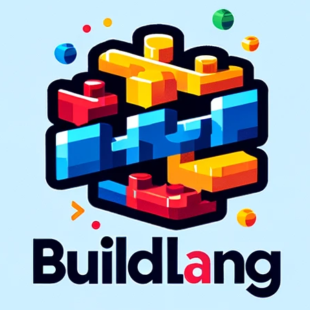

# BuildLang



### by: Ty Valencia, Christine Li, and Will LoGiudice

## Description

A block-based language that builds off the simplicity of Python but has advanced functionality and is even easier to read! This language is good for beginners and advanced programmers alike. BuildLang is supposed to mimic assembling Lego bricks together so that it can bridge the gap for those looking to get into code. It also serves as a good basis as one gets more advanced. As a conglomerate of interesting coding techniques, it can serve as a powerful tool for those who know how to use them.

## Features

- Connecting blocks - functions can be easily connected each other in an intuitive way
- Type Inference - to make it easier to write
- Blocks can run at the same time - inspired by Go's goroutines
- Optionals ? - borrows from JavaScript's approach to handling nulls and errors 
- |> and <| - implemented to streamline flow of data
- Async from JavaScript
- Single Instruction, Multiple Data (SIMD) from Mojo
- Simple generators from Mojo
- Unique IDE - create a clean UI that makes it fun for kids to code (stretch goal)

## Examples

### Hello World

<table>
<tr> <th>Python</th><th>BuildLang</th><tr>
</tr>

<td>

```
if __name__ = main:
    print("Hello world!")
```

</td>
<td>

```
main
    say("Hello world!")
```

</td>
</table>

### Fibonacci Sequence

<table>
<tr> <th>Python</th><th>BuildLang</th><tr>
</tr>

<td>

```
n = 10
num1 = 0
num2 = 1
next_number = num2
count = 1

while count <= n:
    print(next_number, end=" ")
    count += 1
    num1, num2 = num2, next_number
    next_number = num1 + num2
```

</td>
<td>

```
n=10
num1 = 0
num2 = 1
nextNumber = num2
count = 1

while count <= n
    say(nextNumber, " ")
    // increase is ++ in Java, can specify by how much with an numeral after the variable
    increase count
    num1, num2 = num2, next_number
    next_number = num1 + num2
```

</td>
</table>

### Calling multiple functions

<table>
<tr> <th>Python</th><th>BuildLang</th><tr>
</tr>

<td>

```
def multiply(num1, num2):
	return num1 * num2

def convert_binary(num):
	binary_num = ""
    while num > 0:
        binary_num = str(num % 2) + binary_num
        num = num // 2
    return binary_num

def main:
	function2(function1(3, 5))
```

</td>
<td>

```
block multiply(num1, num2)
	send num1 * num2

block convert_binary(num)
	binary_num = ""
    block while num > 0
        binary_num = str(num % 2) + binary_num
        num = num // 2
    send binary_num

main
	// more intuitive way to connect functions
	connect output_of(function1(3, 5)) to input_of(function2())
```

</td>
</table>

### Functions in parallel

<table>
<tr> <th>Python</th><th>BuildLang</th><tr>
</tr>

<td>

```
from concurrent.futures import ThreadPoolExecutor

def task1():
    print("Task 1 is running")

def task2():
    print("Task 2 is running")

with ThreadPoolExecutor() as executor:
    executor.submit(task1)
    executor.submit(task2)
```

</td>
<td>

```
build task1
  say("Task 1 is running")

build task2
  say("Task 2 is running")

main
  create task1
  create task2
```

</td>
</table>

### Optionals

<table>
<tr> <th>Python</th><th>BuildLang</th><tr>
</tr>

<td>

```
def find_user(username):
    if username == "ty":
        return {"username": "ty", "email": "ty@lion.lmu.edu"}
    else:
        return None

if __name__ = __main__:
    user = find_user("ty")
    if user is not None:
        print(user["email"])
    else:
        print("User not found")
```

</td>
<td>

```
block find_user(username) sends user?
  if username == "ty"
    send user(username: "ty", email: "ty@lion.lmu.edu")

main
    // since find_user is an optional, if no value is sent, None will automatically be sent
    user = find_user("ty")
    ifExists user then
        say(user.email)
	else
	    say("User not found")
```

</td>
</table>
